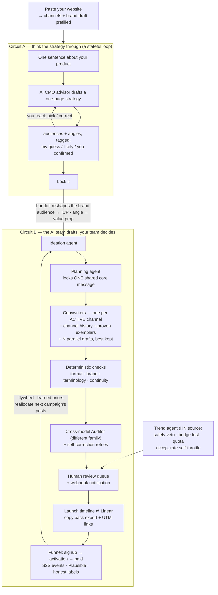

# ReelMatrix — AI Marketing Strategy Copilot + Human-AI Marketing Team OS

> Paste your website. Say one sentence about what you're launching. An AI CMO
> co-creates a one-page strategy with you — **offering options and flagging its
> own guesses** — then an AI marketing team drafts your cross-channel content
> on a team OS with review gates, brand guardrails, channel memory, a
> cross-model auditor, and a first-party ROI loop underneath.
>
> The AI team drafts. **Your team decides.**

**Built for TestSprite Hackathon Season 3 — "Build the Loop."**

**Live demo:** https://reelmatrix.vercel.app (mirror of http://121.43.99.199:3000) · API http://121.43.99.199:8000 ([`/health`](https://reelmatrix.vercel.app/health) reports the deployed commit)
**Demo script:** [DEMO.md](DEMO.md) · **TestSprite fail→fix→rerun log:** [LOOP.md](LOOP.md) · **Team handbook (中文):** [docs/team-handbook.md](docs/team-handbook.md)

### Team

| Name | GitHub | Discord |
| --- | --- | --- |
| Pengcheng Lu | [pengchenglu1997](https://github.com/pengchenglu1997) | `davidlu97` |
| Taixin Zhang | [HarryZ66](https://github.com/HarryZ66) | `harryzhang2595` |
| Ziyu Zhou | [JiimS66](https://github.com/JiimS66) | `ziy33_` |

---

## The five-minute hook

1. **Paste your website** — real social links prefill your channel registry;
   the page copy drafts your brand voice. No forms.
2. **Say what you're launching** — the advisor drafts a one-page strategy:
   3 audience candidates, 3 positioning angles, content pillars, a
   plain-language measure. Every offer is tagged *my guess / likely / you
   confirmed*.
3. **Steer, then lock** — click an option or type a correction; locking
   reshapes the brand's operating context and the AI team drafts
   native-looking posts for **the channels you actually operate**, each aware
   of what already ran there.
4. **See it as a timeline, ship it into your stack** — the launch schedule is
   channel swimlanes on a date axis; one click mirrors it into **Linear**
   (project + issues with due dates, idempotent re-sync). Approved posts
   export as a per-platform **copy pack** with UTM tracking links.
5. **Measure for real** — signup → activation → paid funnel per channel,
   fed by your own backend's **server-to-server conversion events** (no
   third-party cookies), honestly labeled `last-touch · modeled` until real
   events arrive. What converts feeds the flywheel; the flywheel reallocates
   the next campaign's posts — with the reason attached.

## Product flow



## Why not just ChatGPT?

The value lives **above** the model, in the layer a small team can't build for
itself:

- **Channel memory** — the AI only drafts for platforms you actually operate
  (a registry you control), and every new post knows the last five that ran on
  that channel plus its proven best performers as exemplars. Consistency and
  continuity, not a goldfish.
- **A closed, honest loop** — strategy → content → review → timeline → your
  OA tool → first-party conversions → learned priors that visibly reallocate
  the next campaign. Numbers are labeled `last-touch · modeled` until your
  real events replace them.
- **Guardrails** — deterministic format/brand/terminology/continuity checks, a
  claim-check truth rail, a policy gate, a brand-safety kill-switch for trend
  content, and an Auditor from a **different model family** so hallucinations
  don't rubber-stamp themselves.
- **A team, not a textbox** — AI employees are assignable, reviewable,
  attributable, reconfigurable, and metered (the Team tab shows runs/tokens
  per employee).

The model is swappable by config — the top-bar badge shows what's live. The
whole stack is built on **Chinese open-weight models** (Qwen / DeepSeek /
Z-Image), so the same family serves cheap hosted APIs today and an on-prem
deployment tomorrow with zero code change.

## What's real vs. provider-mocked

| Real end-to-end today | Provider-mocked by design (same interfaces, swap-in) |
| --- | --- |
| Strategy loop + A→B handoff on a live LLM | Publishing to social networks (`human_final`; copy-pack export bridges the last mile) |
| Multi-agent drafting + checks + cross-model audit + self-correction + draft fan-out | GA4 ingestion (Plausible connector is real), market intel, enrichment |
| Channel registry + per-channel history/exemplars + continuity check | Effect flywheel numbers until real events arrive (S2S endpoint is live) |
| **Linear timeline sync** (real GraphQL, idempotent) + webhook dispatch + review notifications | Image/video generation by default (DashScope Qwen-Image / Z-Image providers implemented, key-gated) |
| One-URL onboarding (real link detection) | — |
| Hacker News trend source (real, keyless) with a quality funnel | — |
| 220+ backend tests + TestSprite CLI against the live deployment | — |

## Architecture

| Layer | Tech |
| --- | --- |
| Frontend | Next.js 16 · React 19 · TypeScript · Tailwind · Recharts (`apps/web/`) |
| API | FastAPI · Python 3.13 · uv (`apps/api/`) |
| Domain core | Framework-free Python (`core/`) — agents, loops, checks, providers |
| Data | SQLModel + SQLite (dev/demo), row-level `tenant_id` multi-tenancy |
| Contracts | Pydantic v2 strict schemas at every agent handoff, with JSON self-repair for open-weight models |
| LLM | Provider factory: `mock` / `openai` / `dashscope` (Qwen) / `siliconflow` (DeepSeek — the Auditor's family) / `local` (vLLM/Ollama) |
| Visuals | `mock` / `dashscope` (Qwen-Image gen + Qwen3-VL critique) / `zimage` (self-hosted Z-Image-Turbo) |

```text
core/
├── loop/        # the Loop engine (both circuits are instances)
├── strategy/    # circuit A: advisor + loop + A→B handoff
├── agents/      # digital employees: ideation / planning / copywriter / auditor / designer
├── workflows/   # campaign instantiation (+ flywheel reallocation) + task runner (fan-out, self-correct, audit)
├── content/     # platform specs/contracts, checks, scoring, continuity + exemplars, terminology, claim-check
├── analytics/   # attribution ABC: mock + Plausible (self-hostable)
├── trends/      # trend ABC: mock + Hacker News, safety veto
├── media/       # image/vision ABC: mock + DashScope + Z-Image
├── ingest/      # onboarding: site fetch + brand extraction + historical import
├── notify.py    # review-queue webhook (Slack/Feishu/DingTalk)
├── llm/ growth/ policy/ privacy/ identity/ evals/ publish/ ...
└── db/          # models, engine, seed
```

Every external capability follows one pattern — **abstract interface +
deterministic mock + factory** — so the whole product runs offline with zero
keys, and going real is a config change, not a rewrite.

## Quickstart (local, zero keys)

Requires Python 3.13 + [uv](https://docs.astral.sh/uv/), Node 20+.

```bash
uv sync --locked
cd apps/web && npm ci && cd ../..

# seed demo data (tenant, members, channels, ICP segments)
LLM_PROVIDER=mock uv run python -m core.db.seed

# terminal 1 — API
LLM_PROVIDER=mock WEB_ORIGIN=http://localhost:3000 uv run uvicorn apps.api.main:app --port 8000

# terminal 2 — web
cd apps/web && npm run dev

# optional: pump the demo to a full-feature state (campaign, posts, metrics, trends)
uv run python scripts/demo_prep.py
```

Open http://localhost:3000 — paste a site URL or click a suggestion chip.

> No migrations yet: after changing `core/db/models.py`, delete the SQLite
> file and re-seed.

## Going live (cheap open-weight APIs)

Set in `.env` (backend only — keys never reach the browser):

```dotenv
LLM_PROVIDER=dashscope           # Qwen via DashScope
DASHSCOPE_API_KEY=...
DASHSCOPE_MODEL=qwen3-32b

SILICONFLOW_API_KEY=...          # DeepSeek — pin the Auditor to this in the Team tab
ASSET_DRAFT_FANOUT=3             # parallel drafts per post, best kept (cheap with open weights)
TREND_SOURCE=hackernews          # real hot-topic feed (keyless)
# NOTIFY_WEBHOOK_URL=...         # review-queue pings to Slack/Feishu/DingTalk
# ANALYTICS_SOURCE=plausible     # + PLAUSIBLE_SITE_ID / PLAUSIBLE_API_KEY
# MEDIA_PROVIDER=dashscope       # Qwen-Image · VISION_PROVIDER=dashscope for Qwen3-VL critique
```

Per-request override via the `X-LLM-Provider` header. The same open-weight
family self-hosts later (vLLM / Z-Image on a 16 GB GPU) by pointing the
`local` / `zimage` providers at your own endpoints.

**First-party ROI:** your backend reports conversions in ~30 minutes — see
[docs/integration-s2s-events.md](docs/integration-s2s-events.md).

## Deploy (Docker Compose)

`Dockerfile.api` + `Dockerfile.web` + `docker-compose.yml` + `deploy.sh`; the
live demo runs this on an Aliyun ECS box with real Qwen. Walkthrough (中文):
[docs/deploy-aliyun.md](docs/deploy-aliyun.md). `GET /health` returns the
deployed commit sha, so the test loop can verify a fix is live before rerunning.

## Testing — and the TestSprite loop

- **220+ backend tests** (`uv run pytest`) + frontend tests (`npm test`), all
  offline via mock providers. CI runs backend tests, typecheck, frontend
  tests, and the production build.
- The **open-source TestSprite CLI** is the checker for the live deployment;
  every create → run → failure-bundle → fix → rerun round is logged with
  evidence in **[LOOP.md](LOOP.md)**.
- Content quality (would a marketer actually publish this?) has its own
  protocol — see the team handbook below.

## More docs

- [docs/team-handbook.md](docs/team-handbook.md) — **onboarding for new
  teammates (中文)**: content-quality testing protocol, the TestSprite loop,
  LLM procurement/config checklist
- [docs/architecture-enterprise-loop.md](docs/architecture-enterprise-loop.md) — the current slice's design
- [docs/integration-s2s-events.md](docs/integration-s2s-events.md) — first-party conversion events (S2S)
- [DEMO.md](DEMO.md) — the 3-minute demo script · [DESIGN.md](DESIGN.md) — design system
- [docs/deployment-onprem.md](docs/deployment-onprem.md) — on-prem / privacy posture
- [docs/roadmap-growth-engine.md](docs/roadmap-growth-engine.md) · [docs/roadmap-maturity.md](docs/roadmap-maturity.md) — roadmaps

Legacy note: the original single-shot endpoint `POST /api/v1/campaign/generate`
still works, superseded by the copilot + team OS above.
