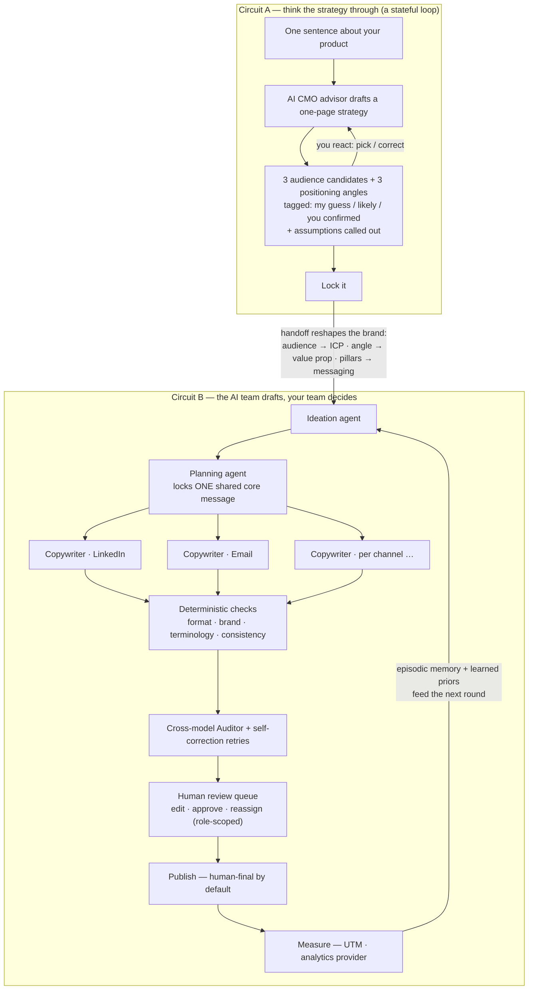

# ReelMatrix — AI Marketing Strategy Copilot + Human‑AI Marketing Team OS

> Type one sentence about your product. Co‑create a one‑page strategy with an AI CMO that
> **offers options and flags its own guesses** — then lock it and watch an AI marketing
> team draft your first cross‑channel content, on a human↔AI team OS with review gates,
> brand guardrails, and a cross‑model auditor underneath.

**Built for TestSprite Hackathon Season 3 — “Build the Loop.”**

**Live demo:** http://121.43.99.199:3000 · API http://121.43.99.199:8000 ([`/health`](http://121.43.99.199:8000/health) reports the deployed commit)
**Demo script:** [DEMO.md](DEMO.md) · **TestSprite fail→fix→rerun log:** [LOOP.md](LOOP.md)

### Team

| Name | GitHub | Discord |
| --- | --- | --- |
| Pengcheng Lu | [pengchenglu1997](https://github.com/pengchenglu1997) | `davidlu97` |
| Taixin Zhang | [HarryZ66](https://github.com/HarryZ66) | `harryzhang2595` |

---

## The five‑minute hook

1. **Say what you’re building** — one sentence is enough; wrong or incomplete is fine.
2. **React, don’t fill forms** — the advisor drafts a one‑page strategy from your input
   plus industry priors: 3 audience candidates, 3 positioning angles, content pillars, a
   plain‑language measure. Every offer is tagged *my guess / likely / you confirmed*, and
   what it had to assume is called out — so you **recognize** the right strategy instead
   of inventing it.
3. **Steer it** — click an option or type a correction; the draft re‑thinks around your
   steer, turn by turn (“How we got here” keeps the trail).
4. **Lock it → first content** — locking reshapes the brand’s operating context
   (audience → ICP segment, angle → value proposition, pillars → messaging), then the AI
   team drafts native‑looking posts per channel — each stamped
   *“Drafted by your AI copywriter · Auditor ✓ · waiting on a human — you.”*

The AI team drafts. **Your team decides.**

## Product flow



Two self‑iterating loops, one shared Loop engine (`core/loop/base.py`) with explicit
brakes (`is_done`, `max_turns`) — orchestration is *sequentially decide → lock the shared
core → render channels in parallel → reconcile (checks + human)*.

## Why not just ChatGPT?

The value lives **above** the model, in the layer a small team can’t build for itself:

- **Memory** — persistent brand profile + ICP segments, episodic notes from every human
  edit and review, working context sliced per agent.
- **A closed loop** — strategy → content → review → publish → measure, not a chat
  transcript that evaporates.
- **Guardrails** — deterministic format/brand/terminology checks, a claim‑check truth
  rail, a policy gate, brand‑safety kill‑switch for trend content, and an Auditor from a
  **different model family** so hallucinations don’t rubber‑stamp themselves.
- **A team, not a textbox** — AI employees are first‑class members: assignable,
  reviewable, attributable, reconfigurable per tenant’s org.

The model itself is swappable by config — the top‑bar badge shows what’s live
(mock / OpenAI / Qwen / any OpenAI‑compatible local runtime).

## What’s real vs. provider‑mocked

| Real end‑to‑end today | Provider‑mocked by design (same interfaces, swap‑in) |
| --- | --- |
| Strategy loop + A→B handoff on a live LLM (Qwen via DashScope on the demo) | Publishing to social networks (`human_final` default) |
| Multi‑agent drafting pipeline + checks + cross‑model audit + self‑correction | GA4/analytics ingestion, market intel, enrichment |
| Team OS: roles, review queues, versions, annotations, org config, usage metering | Effect flywheel / experiments / incrementality (high data bar — progressive unlocks) |
| 199 backend + 6 frontend tests; TestSprite CLI runs against the live deployment | Image/video generation (deterministic mock providers) |

## Architecture

| Layer | Tech |
| --- | --- |
| Frontend | Next.js 16 · React 19 · TypeScript · Tailwind (`apps/web/`) |
| API | FastAPI · Python 3.13 · uv (`apps/api/`) |
| Domain core | Framework‑free Python (`core/`) — agents, loops, checks, providers |
| Data | SQLModel + SQLite (dev/demo), row‑level `tenant_id` multi‑tenancy |
| Contracts | Pydantic v2 strict schemas at every agent handoff |
| LLM | Provider factory: `mock` / `openai` / `dashscope` (Qwen) / `local` |

```text
core/
├── loop/        # the Loop engine (both circuits are instances)
├── strategy/    # circuit A: advisor + loop + A→B handoff
├── agents/      # digital employees: ideation / planning / copywriter / auditor / designer
├── workflows/   # campaign instantiation + task runner (parallel render, self-correct, audit)
├── llm/ media/ analytics/ publish/ trends/ market/ paid/ outbound/   # ABC + mock + factory each
├── content/     # platform specs, checks, scoring, terminology, claim-check, GEO
├── growth/ policy/ privacy/ identity/ ingest/ evals/                 # flywheel, gates, evals
└── db/          # models, engine, seed
```

Every external capability follows one pattern — **abstract interface + deterministic mock
+ factory** — so the whole product runs offline with zero keys, and going real is a config
change, not a rewrite.

## Quickstart (local, zero keys)

Requires Python 3.13 + [uv](https://docs.astral.sh/uv/), Node 20+.

```bash
uv sync --locked
cd apps/web && npm ci && cd ../..

# seed demo data (tenant, members, ICP segments)
DATABASE_URL=sqlite:////tmp/rm_demo.db LLM_PROVIDER=mock uv run python -m core.db.seed

# terminal 1 — API
DATABASE_URL=sqlite:////tmp/rm_demo.db LLM_PROVIDER=mock WEB_ORIGIN=http://localhost:3000 \
  uv run uvicorn apps.api.main:app --port 8000

# terminal 2 — web
cd apps/web && npm run dev
```

Open http://localhost:3000 — it lands on **Strategy**. Click a suggestion chip, iterate,
then **“Lock it → draft my first content.”** Full walkthrough: [DEMO.md](DEMO.md).

> No migrations: after changing `core/db/models.py`, delete the SQLite file and re‑seed.

## Swap the model

Set in `.env` (backend only — keys never reach the browser):

```dotenv
LLM_PROVIDER=mock        # offline, deterministic (default; also the wifi-proof demo mode)
# LLM_PROVIDER=openai    + OPENAI_API_KEY / OPENAI_MODEL
# LLM_PROVIDER=dashscope + DASHSCOPE_API_KEY / DASHSCOPE_MODEL (Qwen, OpenAI-compatible)
# LLM_PROVIDER=local     + LOCAL_LLM_BASE_URL / LOCAL_LLM_MODEL (Ollama, vLLM, …)
```

Per‑request override via the `X-LLM-Provider` header.

## Deploy (Docker Compose)

`Dockerfile.api` + `Dockerfile.web` + `docker-compose.yml` + `deploy.sh` are included; the
live demo runs this on an Aliyun ECS box with real Qwen. Full walkthrough (Chinese):
[docs/deploy-aliyun.md](docs/deploy-aliyun.md).

```bash
cp .env.deploy.example .env   # fill PUBLIC_IP + DASHSCOPE_API_KEY
./deploy.sh                   # build + start both containers
```

`GET /health` returns the deployed commit sha (from `COMMIT_SHA` or a stamped `VERSION`
file) — the test loop verifies a fix is actually live before rerunning.

## Testing — and the TestSprite loop

- **199 backend tests** (`uv run pytest`) + **6 frontend tests** (`npm test`), all
  offline via the mock provider.
- The **open‑source TestSprite CLI** is the checker for the live deployment: banked
  frontend tests drive the real strategy‑co‑creation journey and the lock→first‑content
  handoff in a real browser; backend tests hit the team‑OS API over HTTP. Failures pull a
  failure bundle, get root‑caused and fixed in a dedicated commit citing the test ID,
  redeployed (verified via `/health`), and rerun to green.
- The living log — every round, with evidence — is **[LOOP.md](LOOP.md)**.

## More docs

- [DEMO.md](DEMO.md) — the 3‑minute demo script + Q&A one‑liners
- [DESIGN.md](DESIGN.md) — design system + visual‑generation direction
- [docs/deploy-aliyun.md](docs/deploy-aliyun.md) — one‑command Aliyun deploy (中文)
- [docs/deployment-onprem.md](docs/deployment-onprem.md) — on‑prem / privacy / data onboarding
- [docs/roadmap-growth-engine.md](docs/roadmap-growth-engine.md) · [docs/roadmap-maturity.md](docs/roadmap-maturity.md) — roadmaps

Legacy note: the original single‑shot endpoint `POST /api/v1/campaign/generate` still
works, superseded by the copilot + team OS above.

---

## 中文速览

**是什么**:AI 营销策略副驾 + 人机协同营销团队 OS。一句话想法 → AI CMO 给出**可挑选的**
受众/定位选项(标注置信度与假设)→ 逐轮纠偏 → 锁定后 AI 团队立刻起草各渠道首批内容
(确定性检查 + 跨模型审计 + 人审队列)。**AI 团队起草,你的团队拍板。**

**跑起来**:见上方 Quickstart(默认 mock,零密钥离线可跑);演示脚本见
[DEMO.md](DEMO.md);阿里云一键部署见 [docs/deploy-aliyun.md](docs/deploy-aliyun.md)
(注意:无数据库迁移,改模型字段后需删库重 seed)。

**切真模型**:改 `.env` 的 `LLM_PROVIDER`(`dashscope`=通义千问 / `openai` / `local`),
业务代码零改动;密钥只放根目录 `.env`,绝不进前端或 Git。
